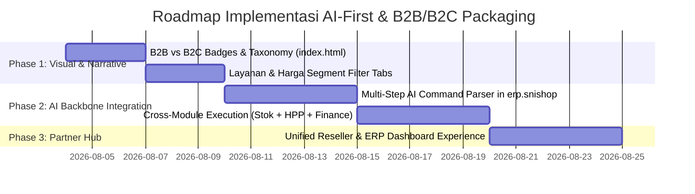

# SNISHOP.ID & ERP.SNISHOP.COM — MASTER PLAN: AI-FIRST BUSINESS PARTNER (B2B & B2C ECOSYSTEM)

> **Dokumen Arsitektur & Strategi Pengemasan Ekosistem (Zero-Discard Plan)**  
> **Target Ekosistem**: Website Utama (`snishop.id` / `WEBSITE SNISHOP UTAMA AGUSTUS 2026`) & Sistem ERP (`erp.snishop.com`)  
> **Visi Utama**: Menjadikan SNISHOP sebagai **Mitra Bisnis Terdepan (B2B)** dengan **AI sebagai Tulang Punggung Operasional (AI-First Autonomous Backbone)** sekaligus mempertahankan seluruh layanan konsumen ritel (**B2C**).

---

## 1. PEMOSISIAN MEREK (BRAND POSITIONING & ECOSYSTEM TAXONOMY)

### 1.1 Prinsip "Zero-Discard" (Pertahankan 100% Aset & Layanan Saat Ini)
SNISHOP saat ini memiliki katalog layanan yang sangat kaya dan terbukti menghasilkan nilai bisnis:
- **Layanan Edukasi** (Cek Plagiasi Turnitin, GPT Zero, AI Detection).
- **Aplikasi Premium** (Canva Pro, Netflix, Zoom Pro, CapCut Pro, Microsoft 365, Gemini Advanced).
- **IT Services & Jasa Web** (Pembuatan Website, Custom System, Maintenance).
- **PPOB & Tagihan serta Topup Game**.
- **Program Kemitraan** (Reseller, Affiliate, Admin Recruitment).
- **Sistem Manajemen Bisnis** (`erp.snishop.com` — POS, Finance, Inventory, Analytics).

**Prinsip Utama**: **Tidak ada satu pun layanan, halaman, atau kode yang dibuang.** Semua layanan dipertahankan 100%, namun **dikemas dan dikelompokkan secara strategis** menjadi 2 pilar ekosistem yang jelas sehingga calon Mitra Bisnis (B2B) langsung melihat kewibawaan SNISHOP sebagai *business partner*, sementara konsumen ritel (B2C) tetap mendapatkan pengalaman belanja yang mudah dan cepat.

---

### 1.2 Pembagian Ekosistem: B2B vs B2C

```
                                  +---------------------------------------+
                                  |         SNISHOP.ID ECOSYSTEM          |
                                  |   (AI-First Digital & Business Hub)   |
                                  +-------------------+-------------------+
                                                      |
                    +---------------------------------+---------------------------------+
                    |                                                                   |
                    v                                                                   v
       +-------------------------+                                         +-------------------------+
       |   PILAR B2B (BUSINESS)  |                                         |  PILAR B2C (CONSUMER)   |
       |  "Mitra Bisnis Modern"  |                                         |  "Digital Lifestyle"    |
       +-------------------------+                                         +-------------------------+
       | • erp.snishop.com       |                                         | • Layanan Edukasi       |
       |   (AI Autonomous ERP)   |                                         |   (Turnitin, GPT Zero)  |
       | • Program Reseller B2B  |                                         | • Aplikasi Premium      |
       | • Affiliate & Kemitraan |                                         |   (Canva, Netflix, Zoom)|
       | • IT Services & Custom  |                                         | • PPOB & Tagihan        |
       |   Development           |                                         | • Topup Game Instant    |
       +-------------------------+                                         +-------------------------+
                    |                                                                   |
                    +---------------------------------+---------------------------------+
                                                      |
                                                      v
                                  +---------------------------------------+
                                  |     AI-FIRST AUTONOMOUS BACKBONE      |
                                  |  (Multi-Step Orchestrator & Action Engine) |
                                  +---------------------------------------+
```

| Karakteristik | Pilar B2B (*Mitra Bisnis / Enterprise / UMKM*) | Pilar B2C (*Konsumen Ritel / Personal / Mahasiswa*) |
| :--- | :--- | :--- |
| **Fokus Layanan** | Sistem ERP (`erp.snishop.com`), Program Reseller/Affiliate, IT Services, Pengelolaan Stok & Keuangan AI, Custom Software. | Cek Plagiasi (Turnitin), Sewa Akun Premium (Canva, Zoom, Netflix), PPOB, Topup Game. |
| **Target Audience** | Pemilik Usaha, UMKM, Distributor, Reseller, Agen PPOB, Perusahaan/Institusi. | Mahasiswa, Kreator Konten, Gamer, Pekerja Lepas, Pengguna Personal. |
| **Value Proposition** | *"Otomatisasi bisnis Anda dari hulu ke hilir dengan AI Autonomous ERP yang bekerja 24/7."* | *"Akses seluruh kebutuhan digital dan edukasi terlengkap, terpercaya, dan harga bersahabat."* |
| **Peran AI-First** | **Autonomous Operational Backbone**: Melakukan input stok, akuntansi, sinkronisasi gudang, HPP, & analisa laba tanpa manual. | **Smart Service Assistant**: Rekomendasi produk, pencarian instan, dan otorisasi transaksi otomatis. |

---

## 2. ARSITEKTUR AI-FIRST AS THE CORE BACKBONE (Bukan Sekadar Chatbot)

### 2.1 Perbedaan "AI Tambahan" vs "AI-First Autonomous Backbone"
- **AI Tambahan (Tradisional)**: AI berdiri di pojok layar sebagai widget chat (FAQ), tidak memiliki akses untuk mengubah data database, dan hanya memberi teks saran.
- **AI-First Backbone (SNISHOP AI)**: AI adalah **mesin penggerak utama (Action-Driven Orchestrator)** yang terintegrasi secara mendalam dengan *database layer*, *business logic*, dan *state management*. AI memiliki izin eksekusi (*Tool Use / Function Calling*) untuk menyelesaikan **rangkaian alur kerja rumit (multi-step workflow)** hanya dari satu perintah bahasa alami (suara atau teks).

---

### 2.2 Bedah Kasus Nyata: Multi-Step Autonomous AI Execution
**Perintah Mitra Bisnis (Lewat Teks / Suara di `erp.snishop.com`):**  
> *"Tambahkan produk A dengan stok 300, harga modal 3000 dan harga jual 10000 dari supplier A dan diletakkan di gudang B"*

#### Alur Eksekusi Otomatis Lintas-Modul (5 Tahapan dalam 0.8 Detik):

```mermaid
sequenceDiagram
    autonumber
    actor User as Mitra Bisnis (B2B)
    participant NLP as AI Intent & Entity Engine
    participant Sup as Supplier Modul
    participant Wh as Warehouse Modul
    participant Inv as Product & Inventory Modul
    participant Fin as Finance & Accounting Modul

    User->>NLP: "Tambahkan produk A, stok 300, modal 3000, jual 10000, supplier A, gudang B"
    NLP->>NLP: Ekstraksi Entitas: {sku:"Produk A", qty:300, cost:3000, price:10000, supplier:"Supplier A", wh:"Gudang B"}
    
    rect rgb(20, 30, 50)
        Note over NLP,Sup: Step 1: Supplier Resolution
        NLP->>Sup: Check Supplier("Supplier A")
        Sup-->>NLP: ID Supplier_A_01 (Atau Auto-Create jika belum ada)
    end
    
    rect rgb(20, 40, 60)
        Note over NLP,Wh: Step 2: Warehouse Resolution
        NLP->>Wh: Check Warehouse("Gudang B")
        Wh-->>NLP: ID Warehouse_B_02
    end
    
    rect rgb(20, 50, 70)
        Note over NLP,Inv: Step 3: Product Master & Inventory Entry
        NLP->>Inv: UpsertProduct({name:"Produk A", cost:3000, price:10000})
        NLP->>Inv: AddStock({sku:"Produk A", qty:300, warehouseId:"Warehouse_B_02"})
        Inv-->>NLP: SKU Created & Stock Updated (+300 unit)
    end
    
    rect rgb(30, 60, 80)
        Note over NLP,Fin: Step 4: Finance & Purchase Accounting Entry
        NLP->>Fin: CreatePurchaseRecord({supplierId, amount: 900000, type:"HUTANG/KAS"})
        Fin-->>NLP: Jurnal Pembelian & HPP Tercatat
    </rect>

    NLP-->>User: "Selesai! Produk A (+300 di Gudang B), Modal Rp3.000, Jual Rp10.000 dari Supplier A tercatat di gudang & buku keuangan."
```

#### Detail Transaksi Lintas Modul yang Dieksekusi AI:
1. **Modul Supplier (`/suppliers`)**: AI mengenali atau mendaftarkan entitas `"Supplier A"`.
2. **Modul Gudang (`/inventory/warehouses`)**: AI memilih lokasi penyimpanan `"Gudang B"`.
3. **Modul Katalog & Stok (`/inventory`)**: 
   - Membuat barang baru `"Produk A"`.
   - Mengatur Harga Pokok Penjualan (HPP/Modal) = **Rp 3.000** dan Harga Jual = **Rp 10.000** (Margin Laba: Rp 7.000 / unit atau 70%).
   - Menambahkan kuantitas = **300 unit** ke stok gudang B.
4. **Modul Keuangan & Akuntansi (`/finance`)**:
   - Secara otomatis membuat catatan transaksi **Pembelian Barang Dagang (Purchase Entry)** senilai **Rp 3.000 x 300 = Rp 900.000**.
   - Mengkategorikan pengeluaran atau hutang dagang ke `"Supplier A"`, serta memperbarui neraca inventaris usaha secara *real-time*.
5. **Konfirmasi Tindakan (Audit Trail)**:
   - Pengguna menerima *Action Card* konfirmasi yang bisa diunduh atau diedit dengan 1 klik, tanpa perlu membuka 4 menu berbeda.

---

## 3. RENCANA PENGEMBANGAN DETAIL PER HALAMAN & PER SECTION (WEBSITE UTAMA `snishop.id`)

Semua halaman pada direktori `WEBSITE SNISHOP UTAMA AGUSTUS 2026` dipertahankan dan dilakukan **pengemasan visual serta naratif (B2B vs B2C Tagging & AI-First Narrative)**.

### 3.1 Halaman Beranda (`index.html`) — 13 Section Utama

| # | Section Saat Ini (id / heading) | Kondisi Saat Ini | Rencana Pengemasan B2B vs B2C & Narasi AI-First |
| :---: | :--- | :--- | :--- |
| **1** | **Header & Navigation Bar** | Logo, Link ke Layanan, Harga, Reseller, Tentang, FAQ, Tombol Login/Register. | • **Penambahan Badge**: Di samping Logo ditambahkan badge kecil `"AI-Powered Partner"`.<br>• **Pemisahan Menu Navigasi**: Menambahkan toggle/pill switch di navbar: **`[Bisnis (B2B)]`** vs **`[Personal (B2C)]`**.<br>• Menu B2B memprioritaskan link ke *ERP Sistem*, *Kemitraan*, dan *IT Services*. |
| **2** | **Hero Section** (`hero-title`: "Platform Digital Terpercaya untuk Bisnis Anda") | Judul, Subjudul umum, dan 1 tombol CTA standar. | • **Perbaikan Narasi Headline**: *"Mitra Bisnis AI-First & Platform Digital Terpercaya di Indonesia"*.<br>• **Dual CTA Action Buttons**:<br>  - Tombol Utama (B2B): **"Coba AI-ERP untuk Bisnis (B2B)"** → menuju ekosistem `erp.snishop.com`.<br>  - Tombol Sekunder (B2C): **"Eksplor Layanan Digital (B2C)"** → scroll ke Katalog Ritel. |
| **3** | **Feature Highlights** (7 Fitur: Kelola bisnis, Cek Plagiasi, Atur keuangan AI, dll.) | Daftar fitur bercampur antara layanan ritel dan fitur sistem bisnis. | • **Visual Tagging per Fitur**:<br>  - `"Kelola bisnis dengan sistem terintegrasi"` → **[B2B • ERP Core]**<br>  - `"Atur keuangan dengan AI assistant"` → **[B2B • AI Backbone]**<br>  - `"Perencanaan anggaran cerdas dengan AI"` → **[B2B • AI Backbone]**<br>  - `"Invoice otomatis untuk bisnis Anda"` → **[B2B • Finance]**<br>  - `"Cek Plagiasi No Repository Tepat..."` → **[B2C • Edukasi]**<br>  - `"Buat formulir profesional dengan mudah"` → **[B2B / B2C • Utility]** |
| **4** | **Katalog Kategori Utama** (6 Kartu: Edukasi, Aplikasi, IT Services, PPOB, Game, Kemitraan) | Enam kartu kategori ditampilkan sejajar dengan gaya yang sama. | • **Pengelompokan Visual (Grouped Layout)**:<br>  - **Grup 1: Solusi Mitra Bisnis (B2B)** → *Program Kemitraan*, *IT Services*, & banner tautan *SNISHOP AI-ERP*.<br>  - **Grup 2: Layanan Digital Personal (B2C)** → *Layanan Edukasi*, *Aplikasi Premium*, *PPOB & Tagihan*, *Topup Game*. |
| **5** | **Layanan Unggulan** (`gradient-text`: Turnitin, Canva, Zoom, Netflix, CapCut, dll.) | Stacking cards untuk 10 produk ritel terpopuler. | • **Pertahankan 100% semua 10 produk**, namun tambahkan **Pill Badges**: `"B2C Favorite"` untuk Canva/Netflix/Turnitin, serta `"B2B Compatible"` untuk Zoom Pro, Microsoft 365, dan Gemini Pro Advanced (untuk produktivitas kantor). |
| **6** | **Lihat Bagaimana Kami Bekerja** (`<h2 class="fade-in">Lihat Bagaimana Kami Bekerja</h2>`) | Narasi alur kerja layanan umum (Pesan -> Proses -> Selesai). | • **Transformasi menjadi "2 Jalur Kerja (Dual-Lane Workflow)"**:<br>  - **Jalur Kerja Mitra Bisnis (B2B AI-First)**: *Perintah Suara/Teks AI* → *Otomatisasi ERP Lintas-Modul (Stok, HPP, Keuangan)* → *Bisnis Berjalan Otomatis 24/7*.<br>  - **Jalur Kerja Konsumen (B2C)**: *Pilih Layanan* → *Pembayaran Otomatis* → *Produk Aktif Instan*. |
| **7** | **Mengapa Memilih SNISHOP?** (`<h2 class="fade-in">Mengapa Memilih SNISHOP.ID?</h2>`) | Poin keunggulan: Terpercaya, Harga Terjangkau, Layanan 24/7, Proses Cepat. | • **Penambahan Pilar "AI Autonomous Backbone"**: Menekankan bahwa SNISHOP bukan sekadar vendor, melainkan mitra bisnis dengan sistem AI yang memangkas 90% pekerjaan manual manajemen usaha. |
| **8** | **Harga Layanan SNISHOP** (`<h2 class="fade-in">Harga Layanan SNISHOP</h2>`) | Daftar harga untuk Turnitin, Canva, Netflix, Zoom, serta harga layanan cepat lainnya. | • **Penambahan Tab Pilihan Harga**:<br>  - **Tab 1: Harga Mitra Bisnis & ERP (B2B)** → Info berlangganan sistem ERP, Paket Reseller, dan Custom API.<br>  - **Tab 2: Harga Layanan Eceran (B2C)** → Menampilkan harga Turnitin, Canva, Netflix, dll. yang sudah ada. |
| **9** | **Apa Kata Mereka? (Testimoni)** (`<h2 class="fade-in">Apa Kata Mereka?</h2>`) | Kartu testimoni pelanggan yang puas. | • **Keseimbangan Testimoni B2B & B2C**: Memastikan ada ulasan dari pemilik toko/mitra UMKM tentang kehebatan fitur AI ERP SNISHOP berdampingan dengan ulasan mahasiswa/konsumen ritel. |
| **10** | **Siap Memulai? (CTA Banner)** (`<h2 class="fade-in" style="color: white;">Siap Memulai?</h2>`) | Banner ajakan bergabung dengan tombol kontak/daftar. | • **Dual CTA**: Button `"Konsultasi Kemitraan B2B"` & `"Daftar Member Sekarang"`. |
| **11** | **Jangkauan & Konektivitas Kami** | Statistik atau ilustrasi jaringan layanan SNISHOP. | • Menambahkan data poin: *"Ribuan Produk B2C Terproses & Ratusan Mitra UMKM Terotomatisasi oleh AI"*. |
| **12** | **Recruitment Admin / Kemitraan** (`<h2 class="recruitment-title">`) | Penawaran komisi bagi admin/reseller. | • Dikemas dengan label tegas: **[B2B Partner Opportunity — Siapapun Bisa Mulai Bisnis dengan Bantuan AI]**. |
| **13** | **Membership Benefits** (`<h2 class="membership-title">`) | Keuntungan member: Dashboard Modern, Passive Income, Referral, Real-time Tracking. | • **Penegasan Fitur AI di Dashboard**: Menjelaskan bahwa member & mitra mendapat akses ke dashboard bertenaga AI yang siap membantu pengelolaan pendapatan dan referral. |

---

### 3.2 Halaman Layanan (`layanan.html`)
- **Struktur Saat Ini**: Menampilkan seluruh katalog produk digital secara komprehensif.
- **Rencana Pengemasan**:
  - Implementasi **Segment Filter Tabs** di bagian atas:
    - **`[Semua Layanan]`** (Default - menampilkan semua 100% tanpa ada yang hilang).
    - **`[Solusi Bisnis & ERP (B2B)]`**: Menampilkan IT Services, Sistem ERP (`erp.snishop.com`), Program Reseller/Affiliate, Sewa Zoom Pro Usaha, Microsoft 365 Bisnis.
    - **`[Layanan Digital & Edukasi (B2C)]`**: Menampilkan Turnitin, GPT Zero, Canva Pro, Netflix, PPOB, Topup Game.
  - Setiap kartu layanan diberikan **Tag Badge** visual (biru untuk B2B, ungu/emas untuk B2C).

---

### 3.3 Halaman Harga (`harga.html`)
- **Struktur Saat Ini**: Tabel dan daftar harga berbagai produk digital.
- **Rencana Pengemasan**:
  - Menambahkan **Tiering Clarity**:
    - **Paket Eceran / Konsumen (B2C)**: Untuk pembelian satuan (Mahasiswa / Personal).
    - **Paket Mitra / Grosir / Reseller (B2B)**: Harga khusus untuk mitra bisnis dengan keuntungan margin dan akses otomatisasi AI Sistem ERP.

---

### 3.4 Halaman Kemitraan (`reseller.html`, `affiliate.html`, `sponsorship.html`)
- **Struktur Saat Ini**: Penjelasan syarat, keuntungan, dan cara bergabung sebagai reseller, affiliate, dan sponsorship.
- **Rencana Pengemasan**:
  - Halaman ini diklasifikasikan penuh sebagai **Pusat Kemitraan Bisnis (B2B Growth Hub)**.
  - **Narasi Utama**: *"Menjadi Reseller / Affiliate SNISHOP bukan sekadar berjualan, tetapi didukung oleh AI Assistant yang membantu mengelola stok, mencatat komisi, dan membuat laporan keuangan usaha Anda secara otomatis."*

---

### 3.5 Halaman Legal & Informasi (`tentang.html`, `faq.html`, `dukungan.html`, `privasi.html`, `syarat.html`)
- **Struktur Saat Ini**: Informasi profil perusahaan, tanya jawab, dukungan pengguna, serta kebijakan privasi dan syarat ketentuan.
- **Rencana Pengemasan**:
  - Di `tentang.html`: Tambahkan narasi filosofi **"AI-First Business Partner"** yang mendedikasikan teknologi kecerdasan buatan untuk kemajuan UMKM dan ekonomi digital Indonesia.
  - Di `privasi.html` & `syarat.html`: Tambahkan klausul **Enterprise Data Security & AI Governance**, memastikan bahwa data transaksi mitra bisnis B2B di ekosistem ERP dilindungi dengan enkripsi tingkat tinggi dan tidak disalahgunakan.

---

## 4. INTEGRASI EKOSISTEM: WEB UTAMA (`snishop.id`) ↔ SISTEM ERP (`erp.snishop.com`)

```
   +-----------------------------------------------------------------------+
   |                       USER ENTRY POINT (snishop.id)                   |
   |                   [Toggle: Mitra B2B  |  Konsumen B2C]                 |
   +-----------------------------------+-----------------------------------+
                                       |
                   +-------------------+-------------------+
                   |                                       |
                   v                                       v
     +---------------------------+           +---------------------------+
     |   MITRA BISNIS (B2B)      |           |   KONSUMEN RITEL (B2C)    |
     +---------------------------+           +---------------------------+
     | • Klik "Masuk ERP AI"     |           | • Pilih Produk            |
     | • Daftar Reseller/Mitra   |           | • Checkout & Pembayaran   |
     +-------------+-------------+           +-------------+-------------+
                   |                                       |
                   v                                       v
     +---------------------------+           +---------------------------+
     |    erp.snishop.com        |           |  PPOB / Digital Delivery  |
     |  (AI Autonomous Engine)   |           |  (Instant Active via AI)  |
     +---------------------------+           +---------------------------+
     | • AI Multi-Step Execution |                                        
     | • Kas, Stok, HPP Otomatis |                                        
     +---------------------------+                                        
```

1. **Jembatan Akses Mulus (Seamless Bridge)**: Website utama `snishop.id` berfungsi sebagai etalase besar. Saat pengguna memilih jalur **B2B (Mitra Bisnis)**, tombol login/register akan diarahkan langsung ke portal `erp.snishop.com`.
2. **Sinkronisasi Identitas (Single Sign-On / Unified Account)**: Satu akun SNISHOP dapat berfungsi sebagai akun pembeli ritel (B2C) di web utama sekaligus akun pengelola usaha/reseller (B2B) di portal ERP.
3. **AI sebagai Konektor Layanan**: Ketika reseller memesan produk digital atau stok grosir di `snishop.id`, **AI Autonomous Backbone** di `erp.snishop.com` otomatis mencatat penambahan stok ritel reseller dan menyusun estimasi margin keuntungannya.

---

## 5. ROADMAP EKSEKUSI PENGEMASAN (IMPLEMENTATION PHASES)



- **Fase 1: Pengemasan Visual & Naratif (Tanpa Ubah Logic Saat Ini)**
  - Mengaplikasikan badge `[B2B • Mitra Bisnis]` dan `[B2C • Layanan Ritel]` pada seluruh kartu di `index.html`, `layanan.html`, dan `harga.html`.
  - Memperbarui headline hero section untuk menonjolkan **"Mitra Bisnis AI-First Terpercaya"**.
- **Fase 2: Penguatan Tulang Punggung AI (AI Backbone di `erp.snishop.com`)**
  - Memastikan *Natural Language Multi-Step Execution* (kasus tambah stok + supplier + gudang + kas keuangan) berjalan mulus di modul ERP.
- **Fase 3: Sinkronisasi Penuh Portal Kemitraan**
  - Menghubungkan alur pendaftaran reseller di `reseller.html` dan `affiliate.html` langsung dengan pembukaan ruang kerja (*workspace*) otomatis di `erp.snishop.com`.

---

## 6. ARSITEKTUR AI LOKAL & INISIATIF EKOSISTEM: GKS & QRIS JELAJAH KULINER 2026

Sebagai perwujudan nyata dari filosofi **"AI yang menjadi tulang punggung sistem beroperasi"**, ekosistem SNISHOP meluncurkan 2 pilar layanan strategis yang didesain dan diciptakan oleh **Siraj Nur Ihrom**:

### 6.1 RupiahIN Brain (`https://rupiahin.snishop.com/`) & Arsitektur Grounded Knowledge Synthesis (GKS)
- **Dasar Inovasi**: Berdasarkan whitepaper teknis **Ref: GKS-WP-2026-001**, RupiahIN Brain menggunakan arsitektur retrieval AI terapan **Grounded Knowledge Synthesis (GKS)** yang dirancang khusus untuk mengatasi keterbatasan LLM konvensional (seperti halusinasi dan konsumsi kredit cloud eksternal yang mahal).
- **6 Pilar Arsitektur GKS**:
  1. **Slang & Colleague-Language Normalization Engine**: Memetakan bahasa keseharian pedagang/UMKM (misal: "modal", "omset", "tekor", "cuan") ke dalam terminologi keuangan baku.
  2. **Multi-Source Layered Retrieval**: Pencarian bertingkat dari 127+ sub-topik regulasi BI, 23 Modul Pembelajaran, dan 213 glosarium berstandar.
  3. **Auditable Chain-of-Thought (CoT) Tracing**: Setiap kesimpulan analisis keuangan atau jawaban tutorial disertai jejak logika yang transparan dan dapat diaudit.
  4. **Automated SmartMarkdown Term-Linking**: Penautan otomatis istilah asing ke glosarium interaktif langsung di dalam antarmuka obrolan.
  5. **Adaptive Semantic-Exact Hybrid Caching**: Caching pintar yang memangkas waktu respons dan menurunkan konsumsi kredit eksternal hingga **91%**.
  6. **Local Domain Grounding**: 100% pemrosesan basis pengetahuan dilakukan lokal dengan tingkat akurasi faktual mencapai **94%**.
- **Manfaat B2B**: Mitra bisnis dan peserta kompetisi mendapatkan **"Second Brain" AI** untuk pendampingan keuangan 24/7 tanpa beban biaya API eksternal.

### 6.2 Usahakan Digital (`https://usahakan.digital/`) & QRIS Jelajah Kuliner Indonesia 2026
- **Misi Kolaboratif**: Mendukung gerakan nasional Bank Indonesia melalui 11 Misi QRIS Jelajah Kuliner 2026.
- **Infrastruktur Pembayaran & Keamanan**:
  - Aktivasi QRIS Dinamis dan Statis bekerja sama dengan **Tripay** (standar keamanan **PCI-DSS**).
  - Proteksi penuh terhadap serangan siber menggunakan **SNI-SHIELD WAF (Web Application Firewall)** dan enkripsi **TLS 1.3**.
- **Dampak Lapangan Nyata**: Bukan sekadar kampanye, platform ini menyediakan dasbor **Kasir Digital UMKM** dan dokumentasi dampak lapangan yang secara live mencatat perkembangan transaksi digital merchant kuliner lokal di seluruh Indonesia.

---

## 7. KESIMPULAN & EXECUTIVE SUMMARY

1. **100% Layanan Dipertahankan**: Tidak ada satu pun layanan edukasi, aplikasi premium, PPOB, topup game, ataupun fitur ERP yang dibuang.
2. **Keterbacaan Ekosistem B2B vs B2C yang Jelas**: Calon mitra bisnis (B2B) langsung dipandu menuju solusi AI ERP, QRIS Usahakan.Digital, dan AI RupiahIN Brain, sedangkan konsumen ritel (B2C) tetap dapat bertransaksi cepat dan nyaman.
3. **AI sebagai Tulang Punggung Sejati**: AI di SNISHOP bukan sekadar pemanis (chatbot FAQ), tetapi **mesin penggerak otomatisasi multi-tahap** dengan arsitektur GKS lokal yang sanggup mengurus stok, HPP, supplier, gudang, dan akuntansi keuangan hanya dari satu perintah praktis.
